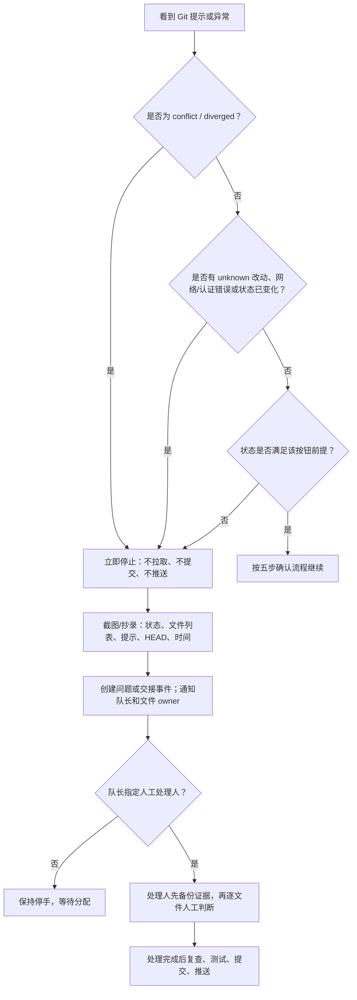

# 冲突停手与人工处理

只要安全脚本显示 `conflict`、`diverged`、未知改动、预期状态已变化，或你看不懂提示，立刻停止 Git 写操作。目标不是“尽快点过去”，而是保证不丢失队友的工作。

## 禁止事项

任何人都不得在本仓库使用或要求脚本执行：

- `git push --force` 或任何 force 推送；
- `git rebase`；
- `git reset`（包括 `--hard`）；
- 手工 `git merge` 或自动 merge；
- `git stash`、`git stash pop`、自动暂存/自动恢复；
- `git clean`、`git checkout`、`git switch`；
- 复制覆盖 `.git/`、删除冲突文件、为了“绿灯”随意选一边。

这些操作不属于本团队的日常流程。冲突处理只能由队长指定的一位熟悉 Git 的人，在保留证据和明确文件归属后人工完成。

## 判断树

## 停手后的 7 项清单

1. 关闭所有拉取、提交、推送确认框，不要重试。
2. 截图 Git 状态条和错误全文；记录时间、电脑名、当前分支、短提交号、涉及文件。
3. 不关闭编辑器中尚未保存的文字；也不要保存到他人正在编辑的同一 JSON 文件。
4. 使用 Agent CLI 创建一个问题：标题写“Git 冲突/状态异常：一句现象”，严重程度按影响选择；`symptoms` 写明文件和提示。
5. CLI 不可用时，把上述信息发给队长，并把截图存到本机桌面；工具恢复后补录问题/事件。
6. 通知当前文件 `owner`。不是 owner 的成员不得替他直接改任务、问题或已认领想法。
7. 等队长指定一位人工处理人；其他两人改做不碰冲突文件的工作，或只记录想法、测试证据。

## 常见状态怎么理解

| 脚本状态 | 含义 | 成员立即动作 |
| --- | --- | --- |
| `conflict` | Git 已发现需要人工选择的同一处改动 | 完全停手，按上表记录 |
| `diverged` | 本地和远端各自有提交，不能快进 | 不拉取、不推送；通知队长 |
| `dirty` 且不是自己的改动 | 有未提交文件，但来源不明 | 不提交、不覆盖；先找产生者 |
| `STALE_GIT_STATE` | 你确认后，文件或远端又变了 | 关闭向导，重新检查远端 |
| `PREEXISTING_STAGED_CHANGES` | 暂存区已有内容 | 不追加暂存；由产生者处理 |
| `authError` / `networkError` | 认证或网络不能安全同步 | 不反复推送；转故障排查 |

## 人工处理人完成前后的责任

处理人先确认：谁是每个冲突文件的事实来源、哪份改动需要保留、是否有测试或截图证据。处理后必须由相应文件 owner 复看内容；对 JSON 还要检查文件名与 `id`、`owner`、关联 ID、时间字段。然后运行与该改动相关的已有检查，写清提交说明，并通过正常五步流程推送。

其他成员不要把“解决冲突”理解为删除对方改动。证据不足时，宁可保留问题为 blocked，也不要猜测最终答案。
