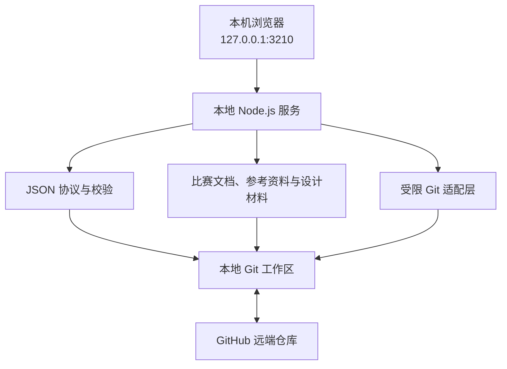

# 电赛赛前协作底座设计规范

> 状态：架构、协作流程与 Claude 橙色核心页面已由用户确认
> 日期：2026-07-28  
> 范围：赛题公布前的通用仓库、文件通讯协议、本地协作看板、Git 安全流程与资料整理  
> 明确边界：本文不预设赛题，不编写尚未公布题目的详细技术方案

## 1. 背景与已确认事实

团队由三人组成，每人使用一台电脑，各自在本机克隆同一个 GitHub
仓库。两位队友可能不熟悉 Git，因此日常协作需要通过中文本地网页完成，
而不是要求所有成员记忆 Git 命令。

截至 2026-07-28，本地工作区已经初始化 Git，并已创建首个设计提交
`7cc4c36`，但尚未配置远端。当前赛前准备以小车、MSPM0G3507
天猛星/地猛星、K230 视觉及相关传感器和执行器为主。题目公布后再决定
最终选题、系统结构和详细方案。

赛事资料显示，2026 年赛区赛于 7 月 29 日 08:00 开始，8 月 1 日
20:00 结束；赛题计划不少于 7 道，并包含 MSPM0 指定题。专题邀请赛
拟于 8 月 23—27 日在武汉大学举行。

参考来源：

- [上海工程技术大学参赛通知](https://www.sues.edu.cn/56/d1/c248a284369/page.htm)
- [全国大学生电子设计竞赛培训网赛题计划](https://www.nuedc-training.com.cn/index/news/details/new_id/351)
- [全国大学生电子设计竞赛培训网邀请赛通知](https://www.nuedc-training.com.cn/index/news/details/new_id/353)

## 2. 目标与非目标

### 2.1 目标

1. 建立适合三台电脑异步协作的 GitHub 仓库。
2. 使用“一项一 JSON 文件”记录任务、问题、想法、事件和成员。
3. 让本地网页成为 Git 新手可以理解的协作入口。
4. 可视化当前任务、进度、阻塞问题、工作区改动、最新提交和远端状态。
5. 提供经过确认的安全拉取、提交和推送流程。
6. 整理比赛通知、硬件资料、焊接教程和外部参考代码。
7. 为赛题公布后的分析、系统框图、接口表、测试记录和方案网页保留稳定入口。
8. 在根目录提供内容完全一致的 `AGENTS.md` 与 `CLAUDE.md`，作为 AI
   和成员共同遵守的顶层规则与目录地图。
9. 让网页、命令行和 AI agent 共用同一套结构化领域动作，所有网页功能
   都能由 agent 在不操作 DOM 的情况下完成。

### 2.2 非目标

1. 赛题公布前不确定最终选题，不编造具体比赛方案。
2. 不引入云数据库、实时协同编辑、聊天系统或成员权限后台。
3. 不把 GitHub Projects、Issues 或第三方服务设为任务真源。
4. 不实现 Cline Kanban 的代理终端、自动执行任务、高自治模式或
   worktree 编排。
5. 不向普通成员暴露强制推送、变基、硬重置、自动暂存恢复或自动合并。
6. 不默认复制大型模型、训练数据集和未经核验的第三方资产。
7. 本地服务不向局域网或公网开放。
8. 不建设离线优先、PWA、离线缓存或断网恢复流程；正常协作默认有网络。

## 3. 核心原则

### 3.1 文件是真源

任务、问题、想法、事件、成员、比赛文档和设计材料均保存在仓库内。网页负责
读取、校验和安全写入这些文件；网页缓存和汇总结果不作为真源。

### 3.2 GitHub 是同步层

三台电脑通过 GitHub 交换提交。自动任务只能检查状态和执行 `fetch`；
任何会修改当前工作区或远端的操作都需要用户确认。

### 3.3 一项一文件

不维护共享的 `tasks.json`、`issues.json`、`ideas.json` 或手工汇总表。
每项任务、问题、想法和事件分别占用一个 JSON 文件，降低三人并行工作时的
冲突概率。

### 3.4 单写者与追加事件

任务、问题和已认领想法由当前 `owner` 负责修改。其他成员的评论、测试结果、
交接和决策写成独立事件文件，不把事件数组回写进父记录。

### 3.5 在线协作为默认条件

正常使用默认三台电脑可以访问 GitHub。网络异常时网页显示同步失败并阻止
远端操作，但断网下的持续编辑、离线缓存和恢复不属于验收范围。

### 3.6 风险动作显式确认

拉取、暂存、提交和推送分别确认。确认框必须说明：

1. 将发生什么。
2. 当前会影响哪些文件或提交。
3. 操作是否可逆以及失败后该怎么做。

### 3.7 Agent-native

网页只是领域动作的一种客户端。任务、问题、想法和事件的创建或更新必须
通过共享动作服务完成；本地 API、Agent CLI 和网页不得各自实现一套写入
逻辑。每个动作都有稳定名称、JSON Schema、幂等键、并发预期和结构化结果。

Agent 可以创建任务、更新或完成自己负责的任务、报告问题、追加事件、
创建或更新想法，以及将想法转换为任务。Agent 不得伪造当前成员、绕过
owner 规则、直接确认拉取/提交/推送，或通过浏览器 DOM 自动化代替领域动作。

## 4. 总体架构



### 4.1 组件边界

- `apps/dashboard`：React/Vite 前端，只通过本地 API 访问仓库。
- `apps/server`：绑定 localhost 的 Node HTTP API；生产模式同时提供
  `apps/dashboard/dist` 静态文件。
- `packages/protocol`：记录与动作 JSON Schema、TypeScript 类型、校验和
  原子写入。
- `packages/git-core`：Git 状态解析、只读查询和受限写操作。
- `比赛管理`：任务、问题、想法、事件、成员和模板。
- `比赛文档`：官方通知、时间线、日志、提交材料和设计规范。
- `参考资料`：硬件资料、焊接调试资料和外部仓库索引。
- `比赛设计`：赛题分析、总体方案、接口约定、测试记录和可视化页面。
- `code`：最终比赛代码。
- `reference-code`：经许可证和来源记录整理后的参考代码。

组件之间只通过明确接口通信。前端不能直接访问文件系统或执行命令；
协议层不依赖 UI；Git 层不能写任务 JSON。

## 5. 仓库目录

```text
/
├── README.md
├── AGENTS.md
├── CLAUDE.md
├── .gitignore
├── 比赛管理/
│   ├── 任务/
│   ├── 问题/
│   ├── 想法/
│   ├── 事件/
│   ├── 成员/
│   └── 模板/
├── 比赛文档/
│   ├── 官方通知/
│   ├── 规则与时间线/
│   ├── 每日日志/
│   ├── 提交材料/
│   ├── 协作规范/
│   └── 设计规范/
├── 参考资料/
│   ├── 硬件资料/
│   ├── 焊接与调试/
│   └── 外部仓库索引/
├── 比赛设计/
│   ├── 赛题分析/
│   ├── 总体方案/
│   ├── 接口约定/
│   ├── 测试记录/
│   └── 可视化页面/
├── 交付物/
├── apps/
│   ├── dashboard/
│   └── server/
├── packages/
│   ├── protocol/
│   └── git-core/
├── code/
├── reference-code/
├── scripts/
└── tests/
```

非代码目录使用中文；代码、测试和构建工具目录使用 ASCII 名称，降低
跨平台工具兼容风险。

### 5.1 本机专用目录

以下目录由应用创建并加入 `.gitignore`：

```text
.本机配置/
.看板缓存/
```

- `.本机配置/settings.json`：本机 GitHub 用户名、端口和显示偏好。
- `.看板缓存/`：解析缓存、远端检查时间、临时写入文件和空 hooks 目录。

本机路径、端口、会话令牌和缓存不得提交。

`settings.json` 使用独立本机 Schema：

```json
{
  "schemaVersion": 1,
  "githubUsername": "37chengshan",
  "port": 3210,
  "autoFetchIntervalSeconds": 60,
  "motionLevel": "system",
  "confirmGitWrites": true
}
```

端口范围为 1024—65535；自动检查间隔范围为 30—600 秒；Git 写操作确认
始终启用，`confirmGitWrites` 的 Schema 使用 `const: true`。首版界面只读
展示该安全状态，不能修改或关闭。`motionLevel` 允许
`system | none | reduced | standard`；`system` 跟随
`prefers-reduced-motion`。

## 6. 顶层 AI 文档

`AGENTS.md` 与 `CLAUDE.md` 必须保持 UTF-8 字节级一致，包含：

1. 项目目标和赛题未公布时的工作边界。
2. 目录地图与每个目录的责任。
3. JSON 协议和单写者规则。
4. Git 操作与外部动作边界。
5. 资料来源、许可证和大型文件规则。
6. 编码、测试、提交和验收要求。
7. 赛题公布后的注入流程。

权威正文保存在 `比赛文档/协作规范/AI顶层规范.md`。同步脚本生成两个
根文件；契约测试检查两个根文件的 SHA-256 是否一致，并检查权威正文与
根文件是否同步。

## 7. JSON 文件通讯协议

### 7.1 通用规则

- 编码：UTF-8。
- 缩进：两个空格。
- 字段名：英文 `camelCase`。
- 时间：带时区的 ISO 8601，例如 `2026-07-28T20:00:00+08:00`。
- Schema：每类记录独立版本，首版 `schemaVersion: 1`。
- Schema 使用 `additionalProperties: false`，未知版本按只读错误处理。
- 未知值省略字段，不使用无语义的 `null`。
- 数组无内容时写空数组。
- 文件名必须与记录 ID 或 GitHub 用户名一致。
- 保存前执行 Schema、引用、自依赖、重复 ID 和文件名校验。
- 引用对象暂未同步到本机时给出警告，不破坏其他记录读取。

### 7.2 ID

采用可读且可由三台电脑独立生成的格式：

- 任务：`T-YYYYMMDD-XXXX`
- 问题：`I-YYYYMMDD-XXXX`
- 想法：`A-YYYYMMDD-XXXX`
- 事件：`E-YYYYMMDD-HHMMSS-XXXX`

`XXXX` 使用大写 Crockford Base32 随机字符。创建前扫描现有文件；发生
碰撞时重新生成，不使用共享计数器。

### 7.3 任务

路径示例：

```text
比赛管理/任务/T-20260728-A3F2.json
```

最小结构：

```json
{
  "recordType": "task",
  "schemaVersion": 1,
  "id": "T-20260728-A3F2",
  "title": "检查小车五路电源",
  "module": "小车主板",
  "status": "todo",
  "priority": "high",
  "participants": [],
  "dependencies": [],
  "blockingIssueIds": [],
  "relatedCommits": [],
  "description": "",
  "acceptanceCriteria": [],
  "completedAcceptanceCriteria": [],
  "createdAt": "2026-07-28T20:00:00+08:00",
  "updatedAt": "2026-07-28T20:00:00+08:00"
}
```

`owner` 在任务认领后加入，其值必须是 GitHub 用户名。允许状态：

```text
todo | doing | blocked | review | done
```

允许优先级：

```text
low | medium | high | critical
```

`module` 为 1—64 个 Unicode 字符，去除首尾空白后不能为空，用于看板筛选；
它不是固定枚举，赛题公布后可以增加新的模块名称。`dueAt` 为可选的带时区
ISO 8601 时间；未确定截止时间时省略，不写 `null`。

`completedAcceptanceCriteria` 中的每一项必须与 `acceptanceCriteria` 的
字符串完全一致且不能重复。任务进入 `done` 前，两者必须是集合相等；没有
验收条件的任务可以直接完成。

`sourceIdeaId` 为可选想法 ID。它只在想法转换生成任务时写入，用于从任务
反查来源；普通任务省略。

任务只能持有单向依赖 `dependencies`，不在被依赖任务中回写反向关系。

### 7.4 问题

路径示例：

```text
比赛管理/问题/I-20260728-91BC.json
```

核心字段：

```json
{
  "recordType": "issue",
  "schemaVersion": 1,
  "id": "I-20260728-91BC",
  "title": "K230 串口偶发丢帧",
  "status": "investigating",
  "severity": "high",
  "owner": "github用户名",
  "blocking": true,
  "linkedTaskIds": [],
  "symptoms": [],
  "workaround": "",
  "resolution": "",
  "relatedCommits": [],
  "createdAt": "2026-07-28T20:10:00+08:00",
  "updatedAt": "2026-07-28T20:10:00+08:00"
}
```

允许状态：

```text
open | investigating | blocked | resolved
```

允许严重程度：

```text
low | medium | high | critical
```

### 7.5 事件

评论、交接、状态变化、测试结果和技术决策各自创建事件文件：

```json
{
  "recordType": "event",
  "schemaVersion": 1,
  "id": "E-20260728-201500-7D2A",
  "entityType": "task",
  "entityId": "T-20260728-A3F2",
  "kind": "testResult",
  "actor": "github用户名",
  "message": "3.3V 与 5V 空载测试通过。",
  "relatedCommit": "0490ea5",
  "createdAt": "2026-07-28T20:15:00+08:00"
}
```

允许 `kind`：

```text
comment | statusChange | handoff | decision | testResult
```

允许 `entityType`：

```text
task | issue | idea
```

可选字段约束：

- `relatedCommit`：7—40 位小写十六进制 Git SHA。
- `supersedesEventId`：符合事件 ID 格式，用于声明本事件修正另一事件。

事件创建后不修改；需要修正时创建新事件并通过 `supersedesEventId` 指向
旧事件。

### 7.6 成员

文件名与 GitHub 用户名一致：

```text
比赛管理/成员/37chengshan.json
```

```json
{
  "recordType": "member",
  "schemaVersion": 1,
  "githubUsername": "37chengshan",
  "roles": ["coordinator"],
  "responsibilities": [],
  "status": "active",
  "createdAt": "2026-07-28T20:00:00+08:00",
  "updatedAt": "2026-07-28T20:00:00+08:00"
}
```

成员不维护另一套昵称。网页头像和公开资料可以在线派生，但不作为本地
记录的必要字段。

允许 `roles`：

```text
coordinator | hardware | firmware | vision | mechanical | testing | documentation
```

同一成员可以承担多个角色。允许 `status`：

```text
active | inactive
```

### 7.7 想法

每项想法使用独立文件：

```text
比赛管理/想法/A-20260728-K3M7.json
```

```json
{
  "recordType": "idea",
  "schemaVersion": 1,
  "id": "A-20260728-K3M7",
  "title": "使用双速视觉链路降低控制延迟",
  "status": "open",
  "author": "github用户名",
  "module": "K230 视觉",
  "description": "高频输出粗坐标，低频输出完整识别结果。",
  "createdAt": "2026-07-28T20:20:00+08:00",
  "updatedAt": "2026-07-28T20:20:00+08:00"
}
```

允许状态：

```text
open | discarded
```

`author` 创建后不可修改。`owner` 为可选 GitHub 用户名；认领后仅 owner
可以修改。`module` 约束与任务一致，`description` 限制为 0—4000 字符。

“已转任务”不是第三个持久状态。读取模型通过查找
`task.sourceIdeaId === idea.id` 派生
`effectiveState: open | converted | discarded`。转换动作只创建一个带
`sourceIdeaId` 的任务，不重写想法，因此不会产生跨两个父记录的半完成状态。
同一想法只能对应一个转换产生的任务；重复转换返回已有任务。

### 7.8 汇总与迁移

网页运行时扫描各目录生成视图，不提交手工总表或缓存索引。

非破坏性变更为当前版本增加可选字段。破坏性变更新建 v2 Schema，并
提供显式迁移命令；迁移前生成恢复点，迁移过程不得隐式执行 Git 提交。

## 8. 网站信息架构

### 8.1 页面

1. `工作台`：个人任务、全队进度、阻塞问题和 Git 总览。
2. `任务`：看板与列表视图。
3. `问题`：故障、待确认事项、临时方法和最终结论。
4. `想法`：赛前灵感、待验证假设、风险和转任务流程。
5. `提交历史`：作者、时间、短哈希、说明、文件和关联任务。
6. `参考资料`：比赛通知、硬件资料、焊接教程和外部仓库。
7. `总体设计`：赛题分析、系统框图、接口约定和 HTML 方案页。
8. `设置`：本机身份、端口、检查频率和安全偏好。

### 8.2 固定应用壳

所有页面共享同一应用壳：

- 1440px 及以上：左侧导航宽 224px，顶部栏高 56px，内容区水平留白
  32px。
- 1024—1439px：左侧导航宽 208px，内容区水平留白 24px。
- 小于 1024px：保持查看和操作能力，但显示“建议使用更宽窗口”；任务
  详情和设计上下文使用抽屉，不隐藏 Git 安全状态。
- 左侧导航固定分为“工作台、任务、问题、想法”“提交历史、参考资料、
  总体设计”，设置固定在底部。
- 当前页面使用 3px 陶土橙左边线和浅橙背景；不通过移动导航位置表达状态。
- 顶部栏始终展示页面位置、最近检查时间、GitHub 连接状态和当前本机成员。

### 8.3 工作台

工作台负责回答“现在应该做什么”，不复制任务页的完整管理能力。页面顺序：

1. 标题、当前比赛阶段和“查看本地改动”“检查 GitHub 更新”操作。
2. 仓库脉搏：分支拓扑、远端提交数量、工作区是否干净及最近检查时间。
3. 远端有更新时显示单行确认提示，入口先进入提交差异查看，不直接拉取。
4. 主区域左侧显示按优先级和依赖排序的今日任务及当前问题。
5. 主区域右侧显示最新提交时间线和三名 GitHub 成员的协作摘要。

任务、问题、提交和成员数字均由真实文件或 Git 状态派生；不使用手工维护的
统计字段。成员协作摘要由成员 `active | inactive`、其负责的进行中任务、
阻塞问题以及最近事件/提交时间组合生成，不表示在线或实时活跃状态。颜色
只表达操作和状态，不把工作台做成多色数据大屏。

### 8.4 任务看板

任务页默认使用四列 Kanban，并提供等价列表视图：

| 看板列 | JSON 状态 | 显示规则 |
|---|---|---|
| 待开始 | `todo` | 未进入执行的任务 |
| 进行中 | `doing`、`blocked` | `blocked` 卡片必须同时展示关联问题和红色阻塞标识 |
| 待验证 | `review` | 展示验收清单完成比例 |
| 已完成 | `done` | 仅在验收条件全部通过后进入 |

看板顶部提供标题/编号搜索、负责人、模块和优先级筛选。每张卡片至少展示：

- 任务 ID、标题和优先级。
- 负责人 GitHub 用户名。
- `module` 模块。
- 阻塞问题数量或验收状态。

选中任务后在右侧详情栏展示完整描述、负责人、状态、优先级、截止时间、
依赖、关联问题、验收清单和对应 JSON 相对路径。所有编辑最终写回该任务
自己的 JSON 文件；拖动卡片只修改状态，不静默修改负责人或依赖。

### 8.5 想法

想法页采用“状态筛选 + 想法列表 + 详情/转任务抽屉”：

- 顶部支持标题、作者、负责人、模块和状态筛选。
- 列表展示想法 ID、标题、摘要、作者、负责人、模块、状态和更新时间。
- 详情展示预期价值、风险、关联任务、关联问题和事件时间线。
- “转换为任务”先展示将创建的任务标题、模块、负责人、优先级和验收条件，
  用户确认领域数据后执行 `idea.promoteToTask`；它不是 Git 提交确认。
- 转换成功后保留原想法并显示新任务链接，不删除历史讨论。
- 空状态解释想法适合记录什么；拒绝状态必须保留理由事件，不能静默消失。

### 8.6 其他页面布局

- `问题`：左侧严重程度和状态筛选，中间问题列表，右侧详情展示症状、
  临时方法、关联任务、事件时间线和最终结论。
- `提交历史`：左侧提交时间线，右侧提交元数据、关联任务、文件列表和
  只读差异；不得把“查看提交”与“推送”合并为同一操作。
- `参考资料`：208px 左筛选加右侧资料列表；每行展示类型、标题、来源、
  固定版本、关联模块、验证状态和安全预览入口。
- `总体设计`：240px 目录、主画布、280px 设计上下文三栏；1024px 时
  右栏收为抽屉。节点至少展示责任、输入/输出和状态。
- `设置`：216px 设置目录加最大 680px 表单，分为身份与仓库、同步检查、
  危险操作；Git 写操作确认固定开启，不能关闭。

### 8.7 Git 确认交互

拉取、提交和推送使用独立分步确认，不使用通用的“确定/取消”空白弹窗：

1. `查看`：展示状态、提交或文件差异，不修改任何内容。
2. `填写`：提交时选择文件并填写说明；拉取和推送展示固定目标分支。
3. `复核`：展示影响数量、目标 HEAD、可逆性和失败处理。
4. `确认`：用户进行最后一次明确确认后才调用写 API。
5. `结果`：成功展示新状态；冲突、状态过期或网络错误时停止并给出中文
   指引，不自动重试写操作。

### 8.8 Cline Kanban 借鉴边界

借鉴：

- 清晰的卡片状态与依赖。
- 卡片关联分支、提交和差异证据。
- 任务详情与 Git 信息同屏。
- 最近提交、变更文件和差异审阅。
- 阻塞状态和操作反馈。

不借鉴：

- 代理终端和多代理编排。
- 自动执行任务。
- 实验性自治权限。
- worktree 自动创建。
- 一键绕过安全确认。

参考：

- [Cline Kanban](https://github.com/cline/kanban)

## 9. Claude 风格视觉规范

视觉方向是温暖中性、克制层级和高信息密度，不复制 Claude/Anthropic
商标、插画、Logo、品牌名称或专有字体。

### 9.1 颜色令牌

```text
页面画布       #F7F5F2
侧边导航       #F1EEE8
面板背景       #FFFEFC
强调面板       #FFFFFF
次级背景       #F5F1EB
默认边框       #E6DFD6
强调边框       #CEC3B7
主文字         #171513
正文           #2E2925
次文字         #746B63
弱文字         #9A9188
主强调橙       #D97757
强调橙深色     #B95D3E
强调橙浅底     #FAE8E0
成功           #54705E
成功浅底       #E5EEE8
警告           #8A642F
警告浅底       #F5EAD8
危险           #9D4941
危险浅底       #F5E3DF
信息           #596D82
信息浅底       #E8EDF1
```

陶土橙用于主操作、当前导航、选中任务和关键系统链路。绿色只表示同步成功、
验证通过或任务完成；红色只表示危险、冲突和阻塞。类型标签使用中性色，
不得让多个高饱和状态色同时争夺注意力。

### 9.2 字体

不得下载、盗链或重新分发 Anthropic 内部字体。使用合法的跨平台替代栈：

```css
--font-title: "Iowan Old Style", "Palatino Linotype",
  "Noto Serif SC", "Songti SC", "STSong", Georgia, serif;
--font-body: Inter, "PingFang SC", "Noto Sans SC",
  "Microsoft YaHei", "Helvetica Neue", Arial, sans-serif;
--font-mono: "JetBrains Mono", "SFMono-Regular", Consolas,
  "Noto Sans Mono CJK SC", monospace;
```

- 页面标题使用编辑衬线字体，24—32px、字重 600。
- 页面小标题使用正文无衬线字体，16px/24px、字重 600。
- 正文使用 14px/22px；元数据不得小于 12px/18px。
- ID、Git SHA 和 JSON 路径使用等宽字体。
- 英文与中文必须分别命中可读回退字体，不以专有字体文件作为运行条件。

### 9.3 表面与层级

- 控件圆角 7—8px，面板 9—12px，对话框不超过 16px。
- 面板主要依靠 1px 边框和留白分层；悬停可以使用轻阴影，静止状态避免
  重阴影。
- 主按钮使用陶土橙实底；次按钮使用暖白底和强调边框。
- 禁止玻璃拟态、霓虹色、大面积渐变、持续闪烁和企业大屏风格。
- 页面只允许用于环境氛围的低对比小范围渐变，不得影响文字对比度。
- 错误先给中文影响和下一步，原始技术信息放在可展开区域。

### 9.4 可访问性与响应式

- 正文和背景的对比度达到 WCAG 2.1 AA；状态不能只依赖颜色。
- 所有按钮、筛选器、卡片和对话框可以通过键盘操作，并有可见焦点。
- 动画遵循 `prefers-reduced-motion`，不使用自动循环位移动画。
- 在 320、375、768、1024、1440 和 2560px 验证真实重排；1024px
  不出现页面级水平溢出。
- 小尺寸隐藏侧栏时，必须提供等价导航；不能隐藏 Git 风险和确认信息。
- 触控目标至少 44×44px；640px 以下的输入框、选择框和文本域字号至少
  16px，不能通过禁用缩放规避 iOS Safari 自动放大。

### 9.5 交互、动画与性能

这是高频使用的产品工具，不使用营销页式入场表演。动画只解释触发来源、
状态变化和操作结果：

| 场景 | 时长 | 方式 |
|---|---:|---|
| 按压、快速关闭 | 100ms | `transform`、`opacity` |
| hover、focus、选中 | 150ms | 颜色与 0.98 press scale |
| toast、成功/错误反馈 | 200ms | opacity + 小幅 translate |
| 菜单、小弹窗 | 250ms | 从触发器方向进入 |
| 抽屉、手风琴 | 300ms | transform；高度展开使用 grid 行 |
| 主要页面切换 | 最多 400ms | 保持壳层稳定，仅内容区过渡 |
| 等待旋转指示 | 800ms/圈 | 匀速，仅在真实等待时显示 |

- 离场约为入场时长的 70%，不得延迟下一步操作。
- 主要动画只使用 transform 和 opacity；禁止动画 width、height、margin
  等引发布局抖动的属性。
- 抽屉和对话框必须捕获焦点，Escape 关闭，关闭后焦点回到原触发器。
- 每个可进入的控件覆盖 idle、hover、active、focus-visible、loading、
  empty、error、disabled、selected/success 和 overflow 状态。
- `motionLevel=none` 使用即时切换；`reduced` 使用不超过 100ms 的淡入淡出；
  `standard` 使用上表时长；`system` 按系统偏好选择 reduced 或 standard。
- 长列表采用分页或窗口化阈值，过滤和搜索避免无意义的全树重渲染。
- 页面按路由拆包；首屏不加载焊接教程、差异查看器和系统画布等重资源。
- 不为基础动效引入大型动画运行时；如引入任何依赖，必须通过构建体积和
  浏览器性能验证证明必要性。

## 10. Git 状态模型

Git 状态不压缩为一个互斥枚举，而是三个轴：

1. 工作区：`clean | dirty | conflict`
2. 拓扑：`unborn | noRemote | synced | ahead | behind | diverged`
3. 连接：`online | networkError | authError`

UI 严重级别：

```text
conflict
> unborn
> noRemote / networkError / authError
> diverged
> behind / ahead
> dirty
> clean
```

### 10.1 状态与允许操作

| 状态 | 允许 | 阻止 |
|---|---|---|
| `unborn` | 状态、暂存、首个提交 | 拉取、推送 |
| `clean + synced` | 状态、自动 fetch | 无意义的提交与推送 |
| `dirty` | 状态、fetch、选择文件、提交 | 拉取、直接推送 |
| `ahead + clean` | 状态、fetch、确认推送 | 无必要拉取 |
| `behind + clean` | 状态、fetch、确认后快进拉取 | 推送 |
| `diverged` | 状态、fetch、差异查看 | 自动拉取、推送 |
| `conflict` | 查看冲突、标记已解决、解决后提交 | 拉取、推送 |
| `networkError` | 查看错误和重试 | fetch、拉取、推送 |
| `authError` | 查看脱敏错误和重新登录指引 | fetch、拉取、推送 |
| `noRemote` | 浏览、编辑、本地提交 | 所有远端操作 |

### 10.2 自动检查

默认每 60 秒：

1. 读取本地 Git 状态。
2. 远端存在且网络可用时执行 `fetch --prune`。
3. 重新计算 ahead/behind。
4. 更新 UI 和最近检查时间。

自动检查不会：

- 移动本地 `main`。
- 修改工作区文件。
- 创建 merge commit。
- 自动暂存、提交或推送。

同一时刻只允许一个 Git 操作。拉取、提交或推送确认框打开后暂停自动
检查；用户最终确认时重新读取 Git 状态。若状态与确认摘要不一致，取消
原操作并要求用户查看刷新后的摘要。

### 10.3 手动拉取

仅在以下条件全部满足时允许：

- 已配置 `origin/main`。
- 工作区干净。
- 无冲突。
- 本地只落后、不领先。
- 用户阅读摘要并确认。

实际命令使用快进限定。非快进时立即停止，不自动合并。

### 10.4 暂存与提交

1. 用户选择文件。
2. 网页展示文件状态和差异摘要。
3. 用户填写必需的提交说明。
4. 网页确认无未解决冲突。
5. 用户确认后执行暂存和本地提交。

默认排除本机配置、缓存、凭据文件和超限二进制。提交只发生在本机，
确认框明确说明其他电脑尚不可见。

### 10.5 推送

推送前必须重新 fetch。仅允许：

- 工作区干净。
- 本地领先。
- 远端不领先。
- 无冲突。
- 已配置上游。
- 在线且认证可用。
- 用户确认目标远端、分支和提交数量。

不提供 force push。

### 10.6 首次远端初始化

远端初始化不由看板执行。原因是创建 GitHub 仓库、配置远端和第一次推送
属于一次性的外部写操作，需要团队负责人明确确认目标仓库。

负责人在本地首个提交完成、GitHub 仓库已经由用户授权创建后，手工执行：

```text
git remote add origin <已确认的 GitHub 仓库 URL>
git push -u origin main
```

另外两位成员随后通过已经确认的 URL 执行 clone。看板的“初始化向导”
只展示当前缺失项和上述步骤，不执行 `remote add`、远端创建或首推。

## 11. 本地 API

后端只提供窄接口：

- 健康与会话：`GET /api/health`
- 任务：`GET /api/tasks`、`POST /api/tasks`、`PUT /api/tasks/:id`
- 问题：`GET /api/issues`、`POST /api/issues`、`PUT /api/issues/:id`
- 想法：`GET /api/ideas`、`POST /api/ideas`、`PUT /api/ideas/:id`、
  `POST /api/ideas/:id/promote`
- 事件：`GET /api/events`、`POST /api/events`
- 成员：`GET /api/members`、`POST /api/members`、
  `PUT /api/members/:githubUsername`
- 资料：`GET /api/materials`、`GET /api/materials/content?path=...`
- 总体设计：`GET /api/design`、`GET /api/design/content?path=...`
- Git 只读：`GET /api/git/status`、`GET /api/git/log`、`GET /api/git/diff`
- Git 写操作：`POST /api/git/fetch`、`POST /api/git/pull`、
  `POST /api/git/commit`、`POST /api/git/push`
- Agent-native：`GET /api/capabilities`、
  `GET /api/schemas/actions/:action`、`POST /api/actions/:action`

仓库根目录在进程启动时固定，API 请求不能传任意仓库路径。写接口只接受
经过 Schema 校验的结构化 JSON，不接受 Shell 命令或任意参数数组。

`POST` 创建新记录；`PUT` 更新 URL 中指定的记录，正文 ID 必须与 URL
一致且不能修改。事件为追加记录，不提供更新接口。资源写接口只是
`POST /api/actions/:action` 的便捷适配器，必须调用同一动作服务，不能复制校验和
文件写入逻辑。

资料接口只能读取 `参考资料` 和 `比赛文档/官方通知` 下的允许文件；
总体设计接口只能读取 `比赛设计`。两个 `content` 接口均执行真实路径
包含检查，并只允许以下扩展名和上限：

| 扩展名 | 最大大小 | 响应类型与校验 |
|---|---:|---|
| `.md` | 1 MiB | UTF-8 文本 |
| `.json` | 1 MiB | UTF-8 且 JSON 可解析 |
| `.html` | 5 MiB | UTF-8，只能进入 sandbox iframe |
| `.png` | 8 MiB | PNG magic bytes |
| `.jpg`、`.jpeg` | 8 MiB | JPEG magic bytes |
| `.webp` | 8 MiB | RIFF/WEBP magic bytes |
| `.pdf` | 20 MiB | PDF magic bytes，浏览器隔离预览或下载 |

不允许 SVG、脚本、可执行文件和未列出的扩展名。服务端按 magic bytes
确认二进制类型，设置固定 `Content-Type` 和
`X-Content-Type-Options: nosniff`，不信任文件名或客户端 MIME。

写任务、问题或想法时，服务端使用 `.本机配置/settings.json` 中的
GitHub 用户名执行单写者校验：

- 未认领记录可以由任一 active 成员认领。
- 已认领记录只能由当前 owner 修改。
- 未认领想法只能由 author 修改或认领；认领后仅 owner 可以修改。
- owner 可以通过一次明确交接把 owner 改为另一 active 成员；服务端同时
  创建 `handoff` 事件。
- 非 owner 只能追加事件，不能修改父记录。

该校验是可信队友之间的协作护栏，不是身份认证或访问控制。成员可以修改
自己的本机配置，因此服务端不声称能阻止恶意冒充；真正的追溯依据是 Git
提交作者、提交差异和团队审阅。服务始终只面向本机单用户，不提供多用户
登录或权限系统。

### 11.1 设置接口

- `GET /api/settings`：读取经过脱敏的本机设置。
- `PUT /api/settings`：只允许更新 `githubUsername`、`port`、
  `autoFetchIntervalSeconds`、`motionLevel`。

端口变更在下次启动生效。会话令牌只存在于内存中，不通过设置接口读取或
写入。客户端尝试修改 `confirmGitWrites` 时返回 400。

### 11.2 Git 接口契约

拉取和推送请求携带确认页面展示时记录的 `expectedHead` 和
`expectedRemoteHead`；提交请求携带 `expectedHead` 和
`expectedChangesHash`；fetch 不接受请求体。执行前服务端重新读取并
比较相应状态；任一值变化时返回 `409 STALE_GIT_STATE`，不执行原操作。

`GET /api/git/diff` 查询参数：

```json
{
  "scope": "worktree",
  "path": "可选的仓库相对路径",
  "commit": "仅 scope=commit 时允许的 7—40 位 SHA"
}
```

- `scope` 只允许 `worktree | staged | commit`。
- `path` 必须通过仓库真实路径包含检查。
- 单次返回最多 1 MiB，超限时返回截断标记，不接受任意 Git 参数。

`POST /api/git/fetch` 不接受用户 Git 参数。自动检查可以调用同一内部能力；
手动调用只返回刷新后的结构化状态。

`POST /api/git/pull` 请求：

```json
{
  "expectedHead": "40位本地 HEAD SHA",
  "expectedRemoteHead": "40位 origin/main SHA",
  "confirmed": true
}
```

仅在 `clean + behind + online` 且不 diverged 时执行固定快进限定命令。

`POST /api/git/commit` 请求：

```json
{
  "files": ["比赛管理/任务/T-20260728-A3F2.json"],
  "message": "docs: 更新小车电源检查任务",
  "expectedHead": "40位本地 HEAD SHA",
  "expectedChangesHash": "64位 SHA-256",
  "confirmed": true
}
```

- `files` 为 1—200 个仓库相对路径，不允许重复。
- 每个路径必须属于仓库且不在忽略/禁止目录中。
- `message` 去除首尾空白后为 1—500 个 Unicode 字符。
- `expectedChangesHash` 是对选中文件的规范化数组
  `[{path,status,contentHash}]` 计算的 SHA-256；删除文件使用固定
  `DELETED` 标记。确认页展示内容与该摘要绑定。
- 执行前要求 Git index 为空。若检测到看板之外预先暂存的内容，返回
  `409 PREEXISTING_STAGED_CHANGES`，列出文件并提示先在原工具中取消
  暂存；首版不自动改动这些暂存内容。
- 服务端获得 Git 操作互斥锁后立即重新计算摘要；不一致则返回 409。
- 服务端先备份当前 index 到 `.看板缓存`，再只对列出的路径执行固定
  `git add -- <paths>`。暂存后使用 index 中的 blob 再计算摘要；
  不一致时恢复原 index 并返回 409。
- 暂存后的路径集合必须与请求 `files` 完全一致；出现额外或缺失路径时
  恢复原 index 并返回 409。
- 两次摘要一致后提交暂存版本。外部编辑器在暂存后继续修改文件，只会
  留下新的未提交改动，不会混入本次已经确认的提交。

`POST /api/git/push` 请求：

```json
{
  "expectedHead": "40位本地 HEAD SHA",
  "expectedRemoteHead": "40位 origin/main SHA",
  "confirmed": true
}
```

服务端先执行固定 fetch 并重新验证 `clean + ahead + online`、远端不领先且
不 diverged，再向固定的 `origin/main` 推送。请求不能指定远端、分支或
额外参数。

Git 操作统一返回：

```json
{
  "ok": true,
  "operation": "commit",
  "state": {},
  "summary": "已创建本地提交",
  "technicalDetails": ""
}
```

`technicalDetails` 经过大小限制和凭据脱敏；失败时返回稳定错误代码、
中文影响说明、建议下一步和最新结构化状态。

认证失败使用稳定错误码 `GIT_AUTH_ERROR`。UI 显示“GitHub 身份验证失败，
未执行远端操作”，并提示使用系统 Git 凭据管理器重新登录；响应和日志均
不得包含用户名之外的凭据、Authorization 头或带凭据 URL。

### 11.3 资料与总体设计读取模型

`GET /api/materials` 返回：

```json
{
  "items": [
    {
      "id": "mspm0-soldering-guide",
      "title": "MSPM0 小车主板焊接教程",
      "type": "tutorial",
      "relativePath": "参考资料/焊接与调试/MSPM0小车主板/焊接教程.html",
      "sourceLabel": "用户导入原件",
      "versionLabel": "REV 0.4.1",
      "modules": ["小车主板", "MSPM0"],
      "verificationStatus": "verified",
      "updatedAt": "2026-07-28T20:00:00+08:00",
      "sizeBytes": 2982969,
      "sha256": "c84dde49c135bb4b3a51035bd332e98a6bab58d67ccab9de7afe85fb7779c665",
      "previewMode": "sandboxHtml"
    }
  ],
  "warnings": []
}
```

允许 `type`：

```text
notice | hardware | tutorial | externalRepository | document
```

允许 `verificationStatus`：

```text
verified | pending | archived | outdated
```

允许 `previewMode`：

```text
text | sandboxHtml | image | pdf | downloadOnly
```

资料列表递归扫描允许目录。标题、类型、来源、模块、许可和验证状态来自与
资料同目录、同 basename 的 `.meta.json` 文件；`relativePath`、大小、
修改时间和哈希由服务端核验。缺少或损坏元数据的资料仍返回，但状态固定为
`pending`，预览能力按实际文件类型收缩，并附结构化警告。
`versionLabel` 为可选的 1—100 字符显示文本，用于硬件版本、文档版本或
固定 Git 提交；未知时省略。

`GET /api/design` 返回：

```json
{
  "entries": [
    {
      "id": "pre-contest-capability-map",
      "title": "赛前能力地图",
      "category": "总体方案",
      "relativePath": "比赛设计/总体方案/赛前能力地图.md",
      "format": "markdown",
      "updatedAt": "2026-07-28T20:00:00+08:00",
      "previewMode": "text"
    }
  ],
  "canvas": {
    "sourcePath": "比赛设计/总体方案/系统画布.json",
    "nodes": [
      {
        "id": "mspm0-control",
        "title": "MSPM0 实时控制",
        "responsibility": "运动控制与状态机",
        "inputs": ["目标坐标"],
        "outputs": ["PWM", "运行状态"],
        "status": "赛前准备",
        "x": 42,
        "y": 18
      }
    ],
    "edges": []
  },
  "context": {
    "issueIds": [],
    "materialIds": ["mspm0-soldering-guide"],
    "decisionEventIds": []
  },
  "warnings": []
}
```

`entries[].category` 只允许 `赛题分析 | 总体方案 | 接口约定 | 测试记录 |
可视化页面`；`format` 只允许 `markdown | html | json`。画布来源固定为
`比赛设计/总体方案/系统画布.json`，不存在时 `canvas` 返回 `null`。节点
坐标为 0—100 的画布百分比；边只引用现有节点。`context` 中的引用由服务端
校验，暂未同步的引用以警告返回，不阻断其他设计内容。

两个响应统一使用：

```json
{
  "warnings": [
    {
      "code": "MATERIAL_METADATA_MISSING",
      "message": "资料缺少元数据，已按待验证项目加载。",
      "target": "参考资料/焊接与调试/示例.html"
    }
  ]
}
```

`code` 为稳定的大写下划线错误码，`message` 为可直接显示的中文说明，
`target` 为仓库相对路径或实体 ID。没有警告时返回空数组。

### 11.4 Agent-native 动作协议

任务、问题、想法、事件和成员读取统一返回记录包装器，不向记录文件写入
服务端元数据：

```json
{
  "data": {
    "recordType": "task",
    "id": "T-20260728-A3F2"
  },
  "relativePath": "比赛管理/任务/T-20260728-A3F2.json",
  "revision": "64位小写SHA-256"
}
```

`revision` 对规范化 JSON 字节计算，用于并发保护。列表响应使用
`{"items": [记录包装器], "warnings": []}`；单项响应直接返回记录包装器。

稳定动作名称：

```text
task.create | task.update | task.setStatus | task.handoff
issue.create | issue.update | issue.handoff
event.append
idea.create | idea.update | idea.promoteToTask
member.update
settings.update
```

`POST /api/actions/:action` 请求：

```json
{
  "idempotencyKey": "agent-run-20260728-7f4c92ab",
  "expectedRevision": "64位小写SHA-256",
  "payload": {
    "id": "T-20260728-A3F2",
    "to": "done",
    "note": "五路电源空载与带载验收均通过。"
  }
}
```

- `idempotencyKey` 为 16—128 个 ASCII 字符，只允许字母、数字、
  `.`、`_`、`:`、`-`。
- 创建动作省略 `expectedRevision`；所有更新、完成、解决、交接和转换动作
  必须携带当前 revision。
- 请求不接受 `actor`。动作服务始终从本机设置读取 GitHub 用户名，并验证
  该成员存在且为 `active`。
- `task.setStatus` 的 `to: done` 就是标记完成，不再另设完成动作；它要求
  `completedAcceptanceCriteria` 与 `acceptanceCriteria` 集合相等。
- `event.append` 只允许 agent 创建 `comment | decision | testResult`；
  `statusChange | handoff` 只能由对应系统动作生成。
- `idea.promoteToTask` 只创建带 `sourceIdeaId` 的任务，不改写想法；同一
  想法重复提升时返回首次创建的任务，不重复创建。

成功响应：

```json
{
  "ok": true,
  "action": "task.setStatus",
  "idempotencyKey": "agent-run-20260728-7f4c92ab",
  "idempotentReplay": false,
  "entities": [
    {
      "recordType": "task",
      "id": "T-20260728-A3F2",
      "relativePath": "比赛管理/任务/T-20260728-A3F2.json",
      "revision": "64位小写SHA-256",
      "updatedAt": "2026-07-28T21:00:00+08:00"
    }
  ],
  "warnings": [],
  "nextActions": [
    {
      "action": "git.commit",
      "label": "审阅改动并创建本地提交",
      "confirmationPolicy": "human"
    }
  ]
}
```

动作回执保存在被忽略的 `.看板缓存/actions/`，文件名使用幂等键的 SHA-256，
不直接使用用户输入作为路径。同一键和相同规范化请求返回原结果；同一键配合
不同请求返回 `409 IDEMPOTENCY_KEY_REUSED`。revision 不一致返回
`409 STALE_ENTITY` 和最新记录包装器，不覆盖其他电脑同步来的改动。所有
领域动作在单仓库写锁内执行，但不会执行任何 Git 写操作。

稳定动作错误码至少包括：

```text
ACTION_VALIDATION_FAILED | ACTION_NOT_SUPPORTED | STALE_ENTITY
IDEMPOTENCY_KEY_REUSED | OWNER_MISMATCH | INACTIVE_MEMBER
PROMOTED_TASK_ALREADY_EXISTS
```

`GET /api/capabilities` 返回协议版本、本机 actor、可用动作、中文说明、
是否要求 revision、是否要求幂等键和 `schemaRef`，并固定声明
`domAutomationAllowed: false`、`directFileMutationAllowed: false`、
`gitConfirmationRequired: true`。`GET /api/schemas/actions/:action` 返回
动作输入 JSON Schema。Agent 首次
操作前先读取 capabilities，不依赖网页文本、CSS 选择器或 DOM。

本机 CLI 与 HTTP 共用同一动作服务：

```text
npm run agent -- capabilities
npm run agent -- action task.create --input <payload.json>
npm run agent -- action task.setStatus --input <payload.json>
npm run agent -- action issue.create --input <payload.json>
npm run agent -- action idea.create --input <payload.json>
npm run agent -- action idea.promoteToTask --input <payload.json>
```

CLI 的 stdout 只输出结构化 JSON，失败使用非零退出码；诊断信息写 stderr
并执行凭据脱敏。CLI 不要求浏览器或服务进程已经启动。

Git 不属于通用领域动作。Agent 可以调用只读 Git 状态、日志、差异和 fetch，
也可以准备拉取、提交或推送摘要；最终写操作必须经过已有的人类确认流程。
通用动作端点不能用来绕过 Git 的 `expectedHead`、
`expectedChangesHash` 或确认规则。

## 12. 安全设计

### 12.1 Git 命令

- 使用 `spawn`/`execFile`，`shell: false`。
- 固定子命令和参数模板，用户不能注入 `-c`、`--git-dir`、
  `--work-tree`、`-C` 等全局参数。
- 禁止 `reset`、`clean`、`rebase`、`checkout`、`switch`、
  `submodule`、任意 `config` 和 force push。
- 网络命令设置超时、输出上限和 `GIT_TERMINAL_PROMPT=0`。
- Git hooks 指向应用创建的空 hooks 目录，避免网页触发仓库脚本。
- 凭据只由系统 Git 凭据管理器处理。

### 12.2 文件路径

- 启动时计算固定 `repoRoot` 的真实路径。
- 所有路径先规范化，再执行真实路径包含检查。
- 拒绝绝对路径、`..`、符号链接逃逸和非允许扩展名。
- 写入仅允许 `比赛管理/任务`、`比赛管理/问题`、`比赛管理/想法`、
  `比赛管理/事件`、`比赛管理/成员` 下的 JSON。
- 本机设置接口仅允许原子写入 `.本机配置/settings.json`，该路径始终
  被 Git 忽略。
- API 不允许覆盖 `.git`、根配置、代码或任意资料文件。

### 12.3 localhost 防护

- 只绑定 `127.0.0.1` 和显式启用时的 `::1`。
- 严格校验 `Host` 与 `Origin`。
- 写请求要求进程启动时生成的随机 `X-Local-Auth` 会话头。
- 不使用跨源 Cookie，不开放 CORS。
- 错误 Host、Origin 或会话头返回 403。

### 12.4 内容防护

- JSON 限制文件大小、字符串长度、数组长度和嵌套深度。
- 拒绝 `__proto__`、`constructor` 和 `prototype` 等危险键。
- HTML 资料只在 sandbox iframe 中预览，不提供
  `allow-same-origin`、顶层导航、表单或弹窗权限。
- 日志不记录完整 JSON/HTML 正文。
- 日志遮盖 Authorization、Token、Cookie、带凭据 URL 和敏感环境变量。
- Git stdout/stderr 有大小限制，超限时给出固定中文错误。

## 13. 错误处理与恢复

### 13.1 JSON

- 写入采用同目录临时文件、完整校验和原子 rename。
- 写入失败时旧文件保持不变。
- 单个 JSON 损坏时隔离该文件，其余记录继续加载。
- UI 展示文件路径、错误字段和修复建议，不自动删除损坏文件。
- 外部编辑器修改文件时，文件监听器防抖后重新校验并刷新。

### 13.2 Git

- 缺少远端：显示初始化向导，不自动创建远端。
- 首次提交前：只允许本地暂存和提交。
- 工作区脏：允许 fetch，阻止拉取。
- 远端领先：阻止推送，要求先安全拉取。
- 分支分叉：阻止拉取和推送，展示双方提交。
- 冲突：禁用推送，列出冲突文件和中文人工处理步骤。
- 网络错误：阻止远端操作，显示网络、代理或 DNS 检查步骤和重试入口。
- 认证失败：不回显凭据，提示使用系统凭据管理器重新登录。

本地看板不自动 stash、pop、rebase 或选择冲突版本。

## 14. 参考资料整理

### 14.1 MSPM0 小车主板焊接教程

原件由用户从本机下载目录导入。设计文档不记录个人主目录绝对路径，使用
文件哈希确认导入对象。

已核验元数据：

```text
标题：MSPM0 小车主板焊接教程 · 从裸板到首次上电
主板：MSPM0 CAR MAINBOARD REV 0.4.1
大小：2,982,969 bytes
SHA-256：c84dde49c135bb4b3a51035bd332e98a6bab58d67ccab9de7afe85fb7779c665
步骤：12
内嵌 JPEG：17
外部资源：无
进度保存：浏览器 localStorage
```

教程覆盖：

- 18 个 0805 阻容。
- 4 个 LED 与 C12 1000µF/16V。
- 天猛星核心板 J5/J6 及 J33/J34 引出座。
- 两组 TB6612 与四组电机编码器接口。
- 3.3V、5V、7.4V、12V、SERVO_5V 五个电源域。
- 灰度、IMU、OLED、K230、ESP32、PID、调试串口、舵机和急停。
- 万用表短路检查与分电源域限流上电。

实施阶段原样复制到：

```text
参考资料/焊接与调试/MSPM0小车主板/焊接教程.html
```

同时创建中文摘要和机器可读元数据。原文件保持哈希不变。嵌入看板时使用
严格 sandbox；因为 sandbox 不授予同源权限，嵌入模式下不保证
localStorage 进度持久化，独立打开原文件时仍可正常保存进度。

### 14.2 K230 钢珠识别参考仓库

来源：

- [37chengshan/k230-steel-ball-detector](https://github.com/37chengshan/k230-steel-ball-detector)
- 核验提交：`0490ea5`（2026-07-28）
- 原创代码与文档：MIT License
- 第三方权重、数据集和依赖：遵守各自许可

当前推荐路线是 YOLO26n epoch 19、416×416、I16W8 KModel 与对应
CanMV 脚本；仓库同时明确记录尚未完成完整 K230 实机验收。因此它只作为
参考基线，不直接定义比赛最终方案。

整理策略：

- 复制 README、LICENSE、CanMV 脚本、训练/转换脚本和测试代码。
- 保留上游 URL、固定 commit、许可证、选取路径和核验日期。
- 默认不复制大型 KModel、PyTorch 权重和训练数据。
- 通过下载清单记录模型文件名、哈希、用途和许可证。
- 明确标记历史故障候选，避免误用于部署。

### 14.3 Cline Kanban

Cline Kanban 仅作交互和信息架构参考。记录上游 URL、参考日期和借鉴点，
不复制品牌资产或无关代码。

## 15. 技术栈

- Node.js `>=20`
- npm workspaces
- TypeScript
- React
- Vite
- 本地 Node HTTP 服务
- JSON Schema + Ajv
- Vitest
- Playwright

开发命令目标：

```text
npm install
npm run dev
npm run build
npm start
npm test
npm run test:integration
npm run test:e2e
```

安装完成后的比赛模式只需一条 `npm start`，不要求成员理解内部构建步骤。

## 16. TDD 与验收

实现遵循红—绿—重构：

1. 先写失败测试并确认失败原因正确。
2. 写最小实现使测试通过。
3. 保持测试全绿后重构。
4. 每个独立任务结束时运行对应验证。

### 16.1 协议与动作测试

- 任务、问题、想法、事件和成员 CRUD。
- Schema 枚举、ID、时间和引用校验。
- `task.setStatus(to=done)` 的验收条件集合校验。
- 想法提升任务写入唯一 `sourceIdeaId`，幂等重试不重复创建。
- 相同幂等键配合不同请求被拒绝，过期 revision 返回最新记录。
- 非 owner 不能修改父记录；agent 不能伪造 `statusChange` 或 `handoff` 事件。
- HTTP 和 CLI 对同一动作返回相同结果与稳定错误码。
- 任一领域动作都不会执行 Git add、commit、pull 或 push。
- 原子写入失败时保留旧文件。
- 截断、非法逗号和半写入 JSON 的隔离。
- 中文目录、中文文件名和含空格路径往返。
- 路径穿越和符号链接逃逸拒绝。

### 16.2 Git 集成测试

使用临时目录构建：

```text
remote.git（本地 bare 仓库）
├── cloneA
├── cloneB
└── cloneC
```

使用真实 Git 命令构造并验证：

```text
clean
dirty
ahead
behind
diverged
conflict
networkError
authError
noRemote
unborn
```

测试不访问真实 GitHub，不执行任何外部写操作。

### 16.3 安全测试

- Shell 元字符和危险 Git 参数不能进入子进程。
- 错误 Host、Origin、会话头返回 403。
- 绝对路径、`..` 和符号链接逃逸被拒绝。
- Token、Cookie 和带凭据 URL 在日志中被遮盖。
- 超大 JSON、HTML 和 Git 输出快速失败。
- 恶意 HTML 不能突破 sandbox 或访问本地 API。

### 16.4 UI 验收

- 在 320、375、768、1024、1440 和 2560px 检查真实重排；没有页面级
  横向溢出，Git 风险信息始终可达。
- 工作台、任务、问题、想法、提交历史、参考资料、总体设计和设置八个页面
  均可用。
- 通过 UI 与 Agent CLI 分别创建任务、标记完成、报告问题、追加事件、
  创建想法并提升为任务，文件结果一致。
- 拉取、提交和推送均有完整确认。
- 网络错误、损坏 JSON、远端领先、分叉和冲突有中文说明。
- 焊接教程可以在 sandbox 中查看。
- 抽屉、弹窗、toast、加载和状态变化的动画可实际触发；关闭 overlay 后
  焦点回到触发器，reduced/none motion 模式保留含义。
- 键盘可以完成核心流程，触控目标和移动表单字号满足规范。
- 首屏压缩后 JavaScript 总量不超过 250 KiB；重型页面按路由懒加载。
- 浏览器脚本执行核心操作流时不出现超过 100ms 的非测试注入长任务。
- 不依赖脆弱的整页像素截图判断功能正确性。

### 16.5 文档验收

- `AGENTS.md` 与 `CLAUDE.md` 字节级一致。
- README 的启动命令真实可运行。
- 所有外部参考记录来源、commit、许可证和日期。
- 没有真实 Token、密码、Cookie 或私有路径进入提交。

## 17. 当前阶段交付

赛题公布前完成：

1. 仓库目录与根文档。
2. JSON Schema、模板和样例。
3. 初始赛前任务、问题和想法。
4. 比赛通知与时间线。
5. 硬件资料、焊接教程和 K230 参考索引。
6. Claude/Cline Kanban 风格本地看板。
7. Git 状态、差异、提交历史与确认式同步。
8. “赛题未公布”的总体设计页面。
9. Agent capabilities、共享动作服务和无浏览器依赖的 Agent CLI。
10. 单元、集成、端到端、安全和性能测试。

## 18. 赛题公布后的注入流程

题目公布后执行固定流程：

1. 将官方题目原件保存到 `比赛文档/官方通知`。
2. 为候选题分别建立赛题分析文档，记录约束、评分点、风险和器材匹配。
3. 通过事件文件记录选题决策及理由。
4. 在 `比赛设计/总体方案` 建立系统架构与模块分工。
5. 在 `比赛设计/接口约定` 固化电气、机械、通信和数据接口。
6. 从总体方案拆分任务和阻塞问题。
7. 在 `比赛设计/测试记录` 按模块保存可重复验证证据。
8. 将最终 Markdown、JSON 和 HTML 方案页面加载到“总体设计”网页。
9. 所有结论关联实际 commit、测试结果和负责人。

赛题公布不会改变底层 JSON 协议、Git 安全边界或仓库目录，只会向稳定
入口中增加比赛特定内容。

## 19. 完成判定

本设计实现完成必须同时满足：

1. 三台 clone 可以通过本地 bare remote 测试完整协作闭环。
2. 任务、问题、想法、事件和成员均为独立、有效的 JSON 文件。
3. 自动任务不修改工作区；所有写 Git 操作经过确认。
4. 八类本地/拓扑 Git 状态以及 `networkError`、`authError`
   两类连接失败路径均有明确行为和测试。
5. 中文路径在文件、Git 和网页三层正常。
6. 八个页面在 320—2560px 可用，动画、键盘、触控和 reduced motion
   通过验收。
7. 本地 API 的命令、路径、来源和会话边界通过安全测试。
8. 焊接教程与参考仓库来源可追溯。
9. 根目录 `AGENTS.md` 与 `CLAUDE.md` 完全一致。
10. 赛题未公布时不出现臆测的具体方案。
11. 网页、HTTP 和 Agent CLI 共用动作服务，并完成创建任务、标记完成、
    报告问题、追加事件、创建想法和提升任务的闭环。
12. 测试、类型检查、性能预算和生产构建均成功。
